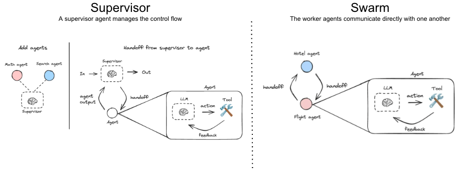

### LangGraph reference architectures deployed on Databricks Model Serving

This library provides references implementations of multi-agent LangGraph systems that incorporate MLflow logging and can be directly deployed to Databriks model Serving. Two architecture references are available: [multi-agent supervisor](https://langchain-ai.github.io/langgraph/agents/multi-agent/#supervisor) and [multi-agent swarm](https://langchain-ai.github.io/langgraph/agents/multi-agent/#swarm).  
 
 

#### Prerequisites
 - A Databricks accounts with access to Model Serving
 - A Databricks Vector Index (for the RAG agent)
   - If you don't have an existing Vector Index, you can easily create one by executing one of the demos available [here](https://www.databricks.com/resources/demos/tutorials/data-science-and-ai/lakehouse-ai-deploy-your-llm-chatbot?itm_data=demo_center). 
 - A Databricks Genie Space (for the Genie agent)
   - If you don't have an existing Genie Space, you can easily create one by installing one of the AI/BI Genie demos available [here](https://www.databricks.com/resources/demos/tutorials?itm_data=demo_center#data-warehouse-and-bi).

#### Project layout
Clone this repository as a git folder in your Databricks Workspace.
 - The **config.yaml** contains information that govern our agent deployment, including the below. Update the configuration to reflect your own Databricks Workspace objects. 
     - The Foundation Model endpoints that power the agents
     - The MLflow Experiment where our agent will be logged
     - The Unity Catalog location where our agens will be registred before serving deployment
     - Location of the Vector Index
     - The Genie Space ID
 - The RAG agent and the Genie Agent are defined in the **agents** directory.
 - The **supervisor_agent.py** file builds a supervisor workflow using the RAG and Genie agents as subagents.
 - To log the superisor agent to an MLflow Experiment and deploy it to a Model Serving endpoint, run the **supervisor_deploy_endpoint** notebook.
 - The **swarm_agent.py** file builds a swarm workflow between the RAG and Genie agents.
 - To log the superisor agent to an MLflow Experiment and deploy it as a Model Serving endpoint, run the **swarm_deploy_endpoint** notebook.

#### Helpful documentation and tutorials:
 - Understanding multi-agent handoffs in LangGraph ([link](https://www.youtube.com/watch?v=WTr6mHTw5cM))
 - Multi-agent swarms in LangGraph ([link](https://www.youtube.com/watch?v=JeyDrn1dSUQ))
 - The [langgraph-supervisor](https://github.com/langchain-ai/langgraph-supervisor-py) library
 - The [langgraph-swarm](https://github.com/langchain-ai/langgraph-swarm-py) library

